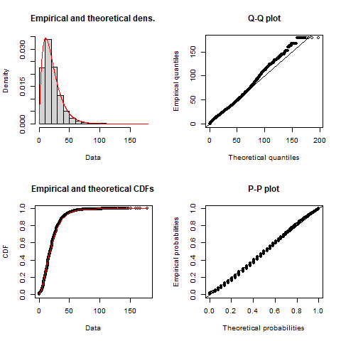

```{r knitr-setup, include=FALSE}
knitr::opts_chunk$set(
  echo = FALSE,
  cache = TRUE,
  warning = FALSE,
  comment = '', 
  out.width = "1\\linewidth")
```

```{r install-data-package, include=FALSE}
if (!require("AccessPack", character.only = TRUE)) {
      remotes::install_github("soukhova/AccessPack",
                        build_vignettes = TRUE)
  }
```

```{r load-packages, include=FALSE, cache=FALSE}
library(AccessPack)
library(dplyr)
library(fitdistrplus)
library(ggplot2)
library(kableExtra)
library(patchwork)
library(sf)
library(scales)
library(stats)
library(ggspatial)
# library(ggpmisc)
# library(ggrepel)
# library(cowplot)
# library(spdep)
# library(RColorBrewer)
# library(extrafont)
# font_import()
# loadfonts(device = "win")

options(scipen = 999)
```

# Introduction

All data used in this manuscript is available in the open data product [`AccessPack`](https://github.com/soukhova/AccessPack). This product is an R data package which consists of six objects and one function. The focus of this manuscript are the two objects sources from the 2016 Transportation Tomorrow Survey (TTS) related to home-to-work commute trips and traffic analysis zone (TAZ) boundaries for the Greater Golden Horse area (GGH) located in southern Ontario, Canada [@data_management_group_tts_2018]. `AccessPack` also includes a function which calculates _spatial availability_, a newly proposed singly-constrained competitive measure discussed in detail in this forthcoming [article](https://github.com/soukhova/Spatial-Availability-Measure). The aim of this paper is to walk readers through the empirical home-based work commute data set and visualize two ways to calculate job access (i.e., how the spatial distribution of jobs and workers can be quantified to reflect potential access to opportunities [@hansen1959]).

# Home-to-work commute data

`AccessPack` includes home-based origins and full-time employment destinations defined by centroids of TAZ (n=`r round(length(AccessPack::ggh_taz$GTA06), 3) %>% prettyNum(big.mark = ",")` within the survey boundaries) with IDs following the GTA06 Zoning System, the number of jobs (n=`r round(sum(AccessPack::ggh_taz$jobs), 3) %>% prettyNum(big.mark = ",")`) and workers (n=`r round(sum(AccessPack::ggh_taz$workers), 3) %>% prettyNum(big.mark = ",")`) at each origin and destination, and the trips from origin to destination for the home-to-work commute (n=`r round(sum(AccessPack::od_ft_tt$trips), 3) %>% prettyNum(big.mark = ",")`). This data was retrieved from the Transportation Tomorrow Survey Data Retrieval System on October 28, 2021 and reflects the trips of full-time employed people _making_ trips to work from within the GGH survey boundaries shown in Figure \ref{fig:TTS-16-survey-area} as defined by the 2016 TTS methodology [@data_management_group_tts_2018].

Also included in `AccessPack` are travel times and cost of travel from origin to destination by car; travel times are calculated using the R package `r5r` [@r5r_2021] and an impedance function based on these travel times is derived. It is important to note that for simplicity, all trips within `AccessPack` are assumed to be taken by car, and the travel time is calculated from an origin TAZ centroid to a destination TAZ centroid. The centroid is snapped to the nearest street line by `r5r` and the travel time is calculated for all trips assuming a car travel mode and a department of 7:00am on Wednesday October 20 2021, a mid-week date selected by the authors. Additionally, only travel times less than or equal to 180 mins (3 hrs) are calculated; this threshold represents 99% of trip's travel times which are summarized in the descriptive statistics in Table \ref{tab:TTS-16-desc-stats}.

```{r TTS-16-survey-area, echo=FALSE, fig.cap="\\label{fig:TTS-16-survey-area}The TTS 2016 study area within the Greater Golden Horseshoe in Ontario, Canada.", out.width="80%", fig.align='center'}
knitr::include_graphics("images/Greater-Golden-Horseshoe-Map.png")
```
```{r creating-desc-stats-table}
#forming a complete descriptive statistic table

Statistics <- data.frame("Statistics" = c("Min.", "1st Qu.", "Median", "Mean", "3rd Qu.", "Max.", "NA's"))

Trips <- data.frame("OD_Trips" = c(summary(od_ft_tt$trips)[[1]] %>% round(), 
                                   summary(od_ft_tt$trips)[[2]] %>% round(),  
                                   summary(od_ft_tt$trips)[[3]] %>% round(), 
                                   summary(od_ft_tt$trips)[[4]] %>% round(), 
                                   summary(od_ft_tt$trips)[[5]] %>% round(),
                                   summary(od_ft_tt$trips)[[6]]%>% round(),
                                   NA))

Travel_time <- data.frame("OD_Travel_time" = c(summary(od_ft_tt$travel_time)[[1]] %>% round(), 
                                               summary(od_ft_tt$travel_time)[[2]] %>% round(),  
                                               summary(od_ft_tt$travel_time)[[3]] %>% round(), 
                                               summary(od_ft_tt$travel_time)[[4]] %>% round(), 
                                               summary(od_ft_tt$travel_time)[[5]] %>% round(), 
                                               summary(od_ft_tt$travel_time)[[6]] %>% round(),  
                                               3507)) 

TAZ_Area <- data.frame("TAZ_Area" = c(summary(ggh_taz$AREA)[[1]] %>% round(), 
                                      summary(ggh_taz$AREA)[[2]] %>% round(), 
                                      summary(ggh_taz$AREA)[[3]] %>% round(), 
                                      summary(ggh_taz$AREA)[[4]] %>% round(), 
                                      summary(ggh_taz$AREA)[[5]] %>% round(), 
                                      summary(ggh_taz$AREA)[[6]] %>% round(), 
                                      NA))

Workers <- data.frame("Workers" = c(summary(ggh_taz$workers)[[1]] %>% round(), 
                                    summary(ggh_taz$workers)[[2]] %>% round(), 
                                    summary(ggh_taz$workers)[[3]] %>% round(), 
                                    summary(ggh_taz$workers)[[4]] %>% round(), 
                                    summary(ggh_taz$workers)[[5]] %>% round(), 
                                    summary(ggh_taz$workers)[[6]] %>% round(), 
                                    NA))

Jobs <- data.frame("Jobs" = c(summary(ggh_taz$jobs)[[1]] %>% round(), 
                              summary(ggh_taz$jobs)[[2]] %>% round(), 
                              summary(ggh_taz$jobs)[[3]] %>% round(), 
                              summary(ggh_taz$jobs)[[4]] %>% round(), 
                              summary(ggh_taz$jobs)[[5]] %>% round(), 
                              summary(ggh_taz$jobs)[[6]] %>% round(), 
                              NA)) 

desc_stats <- cbind(Statistics, Trips, Travel_time, TAZ_Area, Workers, Jobs)

#kable tabling 
desc_stats %>%
  kable(format = "latex",
        align="lrrrrrr",
        booktabs = T,
        col.names = c(" ", "(#)", "(min)", "(km^2)", "(#)", "(#)"),
        caption = "\\label{tab:TTS-16-desc-stats}Descriptive statistics of the trips, workers, and jobs for the traffic analysis zones (TAZ) from the TTS 2016 dataset along with estimated car origin-destination travel times.") %>%
  add_header_above(c(" ", "Trips", "Car Travel Time", "Area", "Workers", "Jobs"), align = "r")%>%
  kable_styling(full_width = "T", 
                latex_options = c("scale_down"),
                position = "center")
```

## Worker trips, workers and jobs

The origin-destination trips are made by people who are employed full-time from their residences (origin) in the GGH to place of work (destination) in the GGH using the GTA06 zoning system. Consequently, the number of workers and jobs is not equal; the boundaries of the survey are permeable, so workers who reside within the boundaries but travel outside of the boundaries are counted as workers within an origin TAZ, while jobs in TAZ that are filled by workers who reside outside the GGH boundaries are _unknown_ since they were not surveyed. This mismatch results in the total number of workers being `r round(sum(ggh_taz$workers)/sum(ggh_taz$jobs),2)` times larger than the number of jobs (i.e., `r sum(ggh_taz$workers)%>% prettyNum(big.mark = ",")` workers to `r sum(ggh_taz$jobs)%>% prettyNum(big.mark = ",")` jobs). While the 2016 TTS survey boundaries are drawn to minimize the difference between opportunities at the destination and supply at the origins they are still not equal <!-- cite? is this true ? -->. That said, this data is from the perspective of home-based trips and as such, the number of trips taken are equal to the number of workers in the GGH.

```{r tts-workers-jobs-plot, fig.cap="\\label{fig:tts-workers-jobs-plot}Number of workers (top) and jobs (bottom) in each TAZ in the GGH area as specified by the 2016 TTS data set.", fig.width=8, fig.height=11}
tts_workers <- ggplot() +
  geom_sf(data = ggh_taz, 
          aes(fill= workers), color = NA) +
    scale_fill_distiller(palette = "Spectral",
                         name = "Full-time employed people",
                         limits = c(0, max(ggh_taz$workers)), 
                         na.value = "grey90")+ 
  theme(legend.position = "right", axis.text = element_blank(),
        panel.grid = element_blank(),
        panel.background = element_rect(size = 1, 
                                        color = "black", 
                                        fill = NA)) +
  annotation_north_arrow(location = "tl", # north arrow for both the main plot and inset
                         height = unit(0.8, "cm"), 
                         width = unit(0.8, "cm"),
                         style = north_arrow_orienteering(line_width = 0.25,
                                                          line_col = "dimgrey", 
                                                          fill = c("white","dimgrey"))) +
  annotation_scale(bar_cols = c("dimgrey", "white"), # scale bar for both the main plot and inset
                   height = unit(0.15, "cm"))

tts_jobs <- ggplot() +
  geom_sf(data = ggh_taz, 
          aes(fill= jobs), color = NA) +
    scale_fill_distiller(palette = "Spectral", trans="sqrt",
                         name = "Full-time jobs \n(square root scale)",
                         limits = c(0, max(ggh_taz$jobs)), 
                         na.value = "grey90")+ 
  theme(legend.position = "right", axis.text = element_blank(),
        panel.grid = element_blank(),
        panel.background = element_rect(size = 1, 
                                        color = "black", 
                                        fill = NA))+
  annotation_north_arrow(location = "tl", # north arrow for both the main plot and inset
                         height = unit(0.8, "cm"), 
                         width = unit(0.8, "cm"),
                         style = north_arrow_orienteering(line_width = 0.25,
                                                          line_col = "dimgrey", 
                                                          fill = c("white","dimgrey"))) +
  annotation_scale(bar_cols = c("dimgrey", "white"), # scale bar for both the main plot and inset
                   height = unit(0.15, "cm"))

tts_workers / tts_jobs
```

```{r ECD-plot, fig.cap="\\label{fig:ECD-plot}The cumulative distribution of the number of jobs and workers per TAZ from the 2016 TTS data set. Light blue shaded ranges correspond to all cumulative proabilities where the number of workers per TAZ are larger than jobs per TAZ. "}

Number <- rbind(ggh_taz$jobs %>% data.frame(),
                 ggh_taz$workers %>% data.frame())
Group <- rbind(rep("Jobs", each=length(ggh_taz$jobs)) %>% data.frame(),
                rep("Workers", each=length(ggh_taz$workers))%>% data.frame())

ecdf_data <- cbind(Number, Group)
colnames(ecdf_data) <- c("Number", "Group")

rect1 <- data.frame(xmin=115, xmax=3055, ymin=-Inf, ymax=Inf)
  
ggplot(ecdf_data , aes(x=Number, col=Group)) + 
  # geom_segment(aes(x = 115, y = 0, xend = 115, yend = 0.34), col = "blue", linetype=2) +
  # geom_segment(aes(x = 3055, y = 0, xend = 3055, yend = 0.94), col = "blue", linetype=2) +
  geom_rect(data = rect1, aes(xmin=xmin, xmax=xmax, ymin=ymin, ymax=ymax), fill="lightblue", alpha=0.2, inherit.aes = FALSE) +
  stat_ecdf() + 
  scale_x_continuous(trans='sqrt', breaks=c(115, 3055, 10000, 20000, 30000, 40000)) + 
  scale_y_continuous(breaks=c(0, 0.25,0.34, .50, .75,0.94, 1.00)) +
  labs(x = "Opportunities per TAZ",
       y = "Cumulative probability") + 
      scale_color_manual("Opportunities", 
                         values = c("Jobs" = "Black",
                                    "Workers" = "Red"))+
  scale_linetype_manual("Opportunities",values=c(0,1)) +
  geom_point(aes(x = 115, y = 0.34), col = "blue")+
  geom_point(aes(x=3055, y=0.94), col = "blue") +
  theme_minimal() +
  theme(plot.title = element_text(hjust=0.5),
        legend.position = c(0.90,0.75),
        axis.line = element_line(colour = "black"),
        panel.border = element_blank()) 
```
Figure \ref{fig:tts-workers-jobs-plot} presents the number of workers and jobs per TAZ. It can be observed that the spatial distribution of jobs and workers is clearly not equal. Workers are concentrated in TAZ within the center of the GGH and along the south-east and northern boarder of the GGH. The center of the GGH corresponds to the Greater Toronto Area (GTA) which is the most densely populated area in southern Ontario [@statistics_canada_daily_2022]. The south east border of the GGH neighbours Lake Ontario and is delineated by the urban built boundary of the Ontario Growth Plan being home to the highest density of working population in the GGH [@ontario_built_2019;@auditor_general_of_ontario_value_2021]. The northern GGH border corresponds to the Simcoe, Dufferin, Kawartha Lake, and Peterborough regions which are home to lower density of worker population density population [@auditor_general_of_ontario_value_2021].  Conversely, the spread of jobs in the GGH is lower than the number of workers indicating employed people are more spatially distributed than places of employment. 

It can also be seen that from the bottom plot in Figure \ref{fig:tts-workers-jobs-plot} that high to medium-low concentrations of jobs are often present in the same areas as workers but only when the scale is transformed. In other words, though there is a higher number of TAZ with no workers than no jobs (i.e., `r ggh_taz %>% st_drop_geometry() %>% count(workers) %>% filter(workers == 0) %>% pull('n')` TAZ with no workers : `r ggh_taz %>% st_drop_geometry() %>% count(jobs) %>% filter(jobs == 0) %>% pull('n')` TAZ with no jobs) and the mean of workers per TAZ is higher than the mean of jobs (i.e., `r round(mean(ggh_taz$workers, na.rm=T),0)` workers : `r round(mean(ggh_taz$jobs, na.rm=T),0)` jobs) the number TAZ with an extreme number of jobs at the highest and lowest percentiles is significantly higher than the number of workers; see the following cumulative probability distribution in Figure \ref{fig:ECD-plot} in which the 94th to 100th percentile and the 0th to 34th percentile of jobs in TAZ is higher than the number of workers in TAZ. This means that between these ranges, TAZ have a higher number of workers than they do jobs, echoing the more even spatial distribution of workers observed in Figure \ref{fig:tts-workers-jobs-plot}.

\newpage

## Calculated travel time

`AccessPack` also includes travel time data for each home-to-work trip as displayed in Figure \ref{fig:plot-tt-ttpertrip}. This travel time corresponds to a car commute calculated using the R package `r5r` [@r5r_2021] and is interpreted as the travel time for a work commute for full-time employed people in the GGH. The travel times were calculated assuming the following input parameters: a 7:00 am departure on Wednesday October 20th 2021, a maximum travel time less than or equal to 180 mins (3 hrs), and a street network retrieved from OpenStreetMaps for the GGH area. The 7:00 am departure corresponds to a typical AM home-to-work departure and the 3 hr threshold was selected as it captures 99% of the trip taken (see the travel times summarized in Table \ref{tab:TTS-16-desc-stats}). 

It is important to note that all travel times within this data set are calculated assuming car travel and one departure time for all origins. These are unrealistic assumptions since we know a minority of trips are taken by non-car modes and travel time departure varies, however, we do not know which trips are made with non-car modes nor exact departures. Though modal split and travel times can be estimated through other methods [e.g., @allen_suburbanization_2021; @higgins2021changes], for simplicity, we carry on with the assumption that all trips are taken by one-time departure car trip. 

```{r data-for-impedance}
# remove all NA trips from dataset and set all 0min travel times to 0.1 min
od_ft_tt  <- AccessPack::od_ft_tt %>% 
  filter( !is.na(travel_time)) %>% 
  mutate(travel_time = ifelse(travel_time == 0, 0.1, travel_time))

all_tt <- od_ft_tt  %>% 
  dplyr::select(trips, travel_time)

all_tt <- all_tt[rep(seq_len(dim(all_tt)[1]), all_tt$trips), 2]
```

```{r fitting-impedance}
#fitting impedance function
gamma_ <- fitdistrplus::fitdist(data=all_tt, "gamma", method="mle", optim.method="Nelder-Mead") 
```

```{r calc-for-accessibility-GGH}
# transfer calibrated impedance function values to OD matrix
od_ft_tt <- od_ft_tt %>%
  mutate(f = dgamma(travel_time, gamma_$estimate["shape"], gamma_$estimate["rate"]))

#add the number of jobs and workers to the od_ft_tt matrix
od_ft <- od_ft_tt %>% merge(ggh_taz %>% dplyr::select(GTA06, workers) %>% st_drop_geometry(),
                   by.x = "Origin", by.y="GTA06", all.x = TRUE)

od_ft <- od_ft %>% merge(ggh_taz %>% dplyr::select(GTA06, jobs) %>% st_drop_geometry(),
                   by.x = "Destination", by.y="GTA06", all.x = TRUE)


#calculate accessibility for workers from any origin to jobs in Toronto 
GGH_c_accessibility <- od_ft %>% 
  mutate(GGH_A_ij = f * jobs) %>%
  group_by(Origin) %>%
  summarise(GGH_A_i = sum(GGH_A_ij, na.rm = T))

#Merge TO accessibly calculation to the ggh_taz:
GGH_taz_acc <- ggh_taz %>% merge(GGH_c_accessibility, by.x=c("GTA06"), by.y=c("Origin"), all.x=T) 
```

```{r calc-for-avail-and-tt-GGH, message=FALSE, include=FALSE}
#calculate spatial availability
GGH_od_ft <- od_ft %>%
  mutate(catch = 1) %>%
  mutate(GGH_V_ij = sp_avail(., 
                         o_id = Origin,
                         d_id = Destination,
                         pop = workers,
                         opp = jobs,
                         r = catch,
                         f = f))

#verify that the sum of all jobs is consistent with the number of jobs
sum(GGH_od_ft$GGH_V_ij, na.rm=T)
sum_jobs <- GGH_od_ft %>% group_by(Destination) %>% summarise(jobs = mean(jobs))
sum(sum_jobs$jobs, na.rm = T)

#aggregating spatial availability  
GGH_availability <- GGH_od_ft %>%
  group_by(Origin) %>%
  summarize(GGH_V_i = sum(GGH_V_ij),
            GGH_sum_tt_i = sum(travel_time),
            GGH_tt_trips_i = mean(travel_time),
            GGH_sum_f_i = sum(f),
            GGH_f_trips_i = mean(f))

#Merge TO availability calculation to the TAZ sf object created for accessibility above:
GGH_taz_acc <- GGH_taz_acc %>% merge(GGH_availability, by.x=c("GTA06"), by.y=c("Origin"), all.x=T) 
```


```{r plot-tt-ttpertrip, fig.cap="\\label{fig:plot-tt-ttpertrip}Estimated total travel time (top) and average travel time per worker (bottom) for TAZ in the GGH.", fig.width=8, fig.height=11, message=FALSE}
tts_total_tt <- ggplot() +
  geom_sf(data = GGH_taz_acc, aes(fill= GGH_sum_tt_i), color = NA) + #data
    scale_fill_distiller(palette = "Spectral", #legend scale bar
                         name = "Total travel time \n(min)",
                         na.value = "grey90") + 
  theme(legend.position = "right", axis.text = element_blank(),
        panel.grid = element_blank(),
        panel.background = element_rect(size = 1, 
                                        color = "black", 
                                        fill = NA))+
  annotation_north_arrow(location = "tl", # north arrow for both the main plot and inset
                         height = unit(0.8, "cm"), 
                         width = unit(0.8, "cm"),
                         style = north_arrow_orienteering(line_width = 0.25,
                                                          line_col = "dimgrey", 
                                                          fill = c("white","dimgrey"))) +
  annotation_scale(bar_cols = c("dimgrey", "white"), # scale bar for both the main plot and inset
                   height = unit(0.15, "cm"))


tts_tt_per_trip <- ggplot() +
  geom_sf(data = GGH_taz_acc, aes(fill= GGH_tt_trips_i), color = NA) + #data
    scale_fill_distiller(palette = "Spectral", #legend scale bar
                         name = "Average travel time \n(min)",
                         na.value = "grey90") + 
  theme(legend.position = "right", axis.text = element_blank(),
        panel.grid = element_blank(),
        panel.background = element_rect(size = 1, 
                                        color = "black", 
                                        fill = NA))+
  annotation_north_arrow(location = "tl", # north arrow for both the main plot and inset
                         height = unit(0.8, "cm"), 
                         width = unit(0.8, "cm"),
                         style = north_arrow_orienteering(line_width = 0.25,
                                                          line_col = "dimgrey", 
                                                          fill = c("white","dimgrey"))) +
  annotation_scale(bar_cols = c("dimgrey", "white"), # scale bar for both the main plot and inset
                   height = unit(0.15, "cm"))

tts_total_tt / tts_tt_per_trip
```

\newpage

As can be observed in Figure \ref{fig:plot-tt-ttpertrip}, the total travel time (min) resembles the spatial trend distribution in the number of employed people in the previous plot (Figure {fig:tts-workers-jobs-plot}). However, when the average travel time per trip in each TAZ is presented, the spatial distribution is distinct from all other plots presented so far. We can see that in areas around the south-eastern border that make up the Greater Toronto and Hamilton Area (GTHA) (e.g., Hamilton, Halton, Peel, Toronto, York, Durham) and Niagara and Waterloo, the average travel times are moderately low. Further from these areas, travel times are higher. Interestingly, even in eastern areas (e.g., Peterborough) with high employment and high job concentration, average travel time is higher than within the GTHA.

## Travel cost: calibrating an impedance function for accessibility

With travel time and places of full-time employment, _accessibility_ can be calculated. Accessibility is a measured property of the origin (i.e., origin TAZ in our data) and is a common approach to quantify the intensity of the potential for demand (i.e., workers) to interact with opportunities (i.e., jobs)  <!-- cite -->. In other words, accessibility in our case informs readers on how much full-time job access each origin has for the people who reside there assuming travel cost corresponds to the calibrated impedance function and the number of full-time jobs. A widely used accessibility measure is based on the gravity model and follows the formulation shown in Equation (\ref{eq:conventional-accessibility}).

\begin{equation}
\label{eq:conventional-accessibility}
A_i = \sum_{j=1}^JO_jf(c_{ij})
\end{equation}

\noindent where:

-   $A$ is accessibility. 
-   $i$ is a set of origin locations.
-   $j$ is a set of destination locations.
-   $O_j$ is the number of opportunities at location $j$. These are opportunities for activity and add some sort of *supply* to the area;
-   $c_{ij}$ is a measure of the cost of moving between $i$ and $j$
-   $f(\cdot)$ is an impedance function of $c_{ij}$; it can take the form of any monotonically decreasing function chosen based on positive or normative criteria [@paez2012measuring].

Formally, accessibility $A_i$ is the weighted sum of opportunities that can be reached from location $i$, given the cost of travel $c_{ij}$. Summing the opportunities in the neighborhood of $i$ as defined by the impedance function $f(\cdot)$, provides estimates of the number of opportunities that can be reached from $i$ at a certain cost. This impedance function is often calibrated using the trip length distribution (TLD) of the origin-destination data [@horbachov_theoretical_2018; @batista_estimation_2019] and the TLD is the representation of the likelihood that a proportion of trips are taken at a specific travel cost. In other words, in our data set where we assume travel cost is travel time, a origin-destination trip with a low travel time has a high impedance function value and a trip with a high travel time has a low impedance function.

In the GGH data presented, the empirical TLD (i.e., proportion of trips taken vs. travel time in minutes) is fitted to a density distribution using the maximum likelihood estimation and the Nelder-Mead method for direct optimization available within the `fitdistrplus` package [@fitdistrplus_2015]. Based on goodness-of-fit criteria and diagnostics seen in Figure \ref{fig:TLD-Gamma-plot}, the gamma distribution is selected for the presented data (also see Figure \ref{fig:plot-cullen-frey} in the Appendix). 

```{r save-impedance-plot, include=FALSE}
# For some reason plot(gamma_) does not play well with knitr, so instead we save the figure and then include it as a graphic in the following chunk
png("images/impedance_function.png")
plot(gamma_)
dev.off()
```

```{r TLD-Gamma-plot, fig.cap="\\label{fig:TLD-Gamma-plot}Empirical TTS 2016 home-based car trip length distribution (black) and calibrated gamma distribution impedance function (red) with associated Q-Q and P-P plots"}

```

The resulting calibrated impedance function is given in the following general form where the estimated 'shape' is $\alpha$ = `r round(gamma_$estimate[1], 3)`, the estimated 'rate' is $\beta$ = `r round(gamma_$estimate[2], 3)` , and $\Gamma(\alpha)$ is defined in Equation (\ref{gamma-dist}).

\begin{equation}
\label{gamma-dist}
\begin{array}{l}\ 
f(x, \alpha, \beta) = \frac {x^{\alpha-1}e^{-\frac{x}{\beta}}}{ \beta^{\alpha}\Gamma(\alpha)} \quad \text{for }	0 \leq x \leq \infty\\
\Gamma(\alpha) =  \int_{0}^{\infty} x^{\alpha-1}e^{-x} \,dx\\
\end{array}
\end{equation}


# Calculating job access in different ways

As introduced in Equation (\ref{eq:conventional-accessibility}), accessibility can be simply calculated for the origins in each TAZ. The accessibility value for each TAZ represents how many opportunities, after being discounted by their travel cost, are _potentially_ accessible to the population within that TAZ. There have been many types of accessibility equations proposed and the field of research is continuously growing so developing an easy-to-manipulate empirically-based data set, as presented in this paper, is essential to experimenting with novel iterations of measures.

For instance, in `AccessPack`, a function for a newly proposed _singly-constrained competitive_ accessibility measure referred to as spatial availability is available to use. This new measure responds to the criticism that the conventional accessibility measure is not explicitly meaningful [@miller2018] and does not consider competition [@luo2003]. It seeks to answer the following questions which the conventional accessibility measure Equation (\ref{eq:conventional-accessibility}) can not :

- "many opportunities are accessible, but the same opportunities are also accessible to my (possibly) numerous neighbours... what does a high accessibility actually mean to me?"; and
- "a few opportunities are accessible to me but I am located in a remote area with proportionally few neighbours relative to the region... what does low accessibility mean to me?". 

The proposed spatial availability measure proportionally allocates the number of opportunities based on the travel cost and demand population (i.e., workers) constraints the number of opportunities and is presented in it's general form in Equation \ref{eq:spatial-availability}. Please see the forthcoming [article](https://github.com/soukhova/Spatial-Availability-Measure) for an in-depth introduction and discussion on how it differs from the conventional accessibility measure.

\begin{equation}
\label{eq:spatial-availability}
V_{ij} = O_j\frac{F^p_{ij} \cdot F^c_{ij}}{\sum_{i=1}^K F^p_{ij} \cdot F^c_{ij}}
\end{equation}

\noindent where:

-   $V_{ij}$ is spatial availability. 
-   $i$ is a set of origin locations in the region $K$.
-   $j$ is a set of destination locations in the region $K$.
-   $O_j$ is the number of opportunities at location $j$ in the region $K$.
-   $F^p_{ij}$ is the proportional allocation factor of the population in $i$ relative to the population in region $K$.
-   $F^c_{ij}$ is the proportion allocation factor of travel cost for $i$ relative to the travel cost in region $K$; it is a product of a monotonically decreasing (i.e., impedance) function associated with the cost of travel between $i$ and $j$.

Figure \ref{fig:plot-access-SA-GGH-TTS} visualizes the two opportunity access measures which can facilitate understanding on how the measures differ. The accessibility plot follows a distinct radial trend where the majority of TAZ in Toronto have high accessibility values and values gradually decrease in TAZ which are further from Toronto's boundary (show in grey outline). Conversely, spatial availability does not appear to follow a radial trend and values appear more even throughout the GGH in comparison to job access as measured by accessibility. This can be noted in higher values around the north east and south west periphery TAZ and more moderate values in and around Toronto. 

```{r plot-access-SA-GGH-TTS, fig.cap="\\label{fig:plot-access-SA-GGH-TTS}Calculated accessibility (top) and spatial availability (bottom) of employment in the GGH area", fig.width=8, fig.height=11, message=FALSE}
## accessibility

#creating the main plot
mplot_access_TTS_GGH <- ggplot() +
  geom_sf(data = GGH_taz_acc, aes(fill= GGH_A_i), color = NA) + #data
    scale_fill_distiller(palette = "Spectral", #legend scale bar
                         name = "Accessibility \n(A_i)",
                         na.value = "grey90") +
  geom_sf(data = toronto_muni_bound, # border for Toronto
          colour=alpha("dimgrey",1), 
          size = 0.5, fill=NA, 
          show.legend = "polygon") + 
  theme(legend.position = "right", axis.text = element_blank(),
        panel.grid = element_blank(),
        panel.background = element_rect(size = 1, 
                                        color = "black", 
                                        fill = NA))+
  annotation_north_arrow(location = "tl", # north arrow for both the main plot and inset
                         height = unit(0.8, "cm"), 
                         width = unit(0.8, "cm"),
                         style = north_arrow_orienteering(line_width = 0.25,
                                                          line_col = "dimgrey", 
                                                          fill = c("white","dimgrey"))) +
  annotation_scale(bar_cols = c("dimgrey", "white"), # scale bar for both the main plot and inset
                   height = unit(0.15, "cm"))

## spatial availability 

mplot_SA_TTS_GGH <- ggplot() +
  geom_sf(data = GGH_taz_acc, aes(fill= GGH_V_i), color = NA) + #data
    scale_fill_distiller(palette = "Spectral", #legend scale bar
                         name = "Spatially Availability \n(V_i)",
                         na.value = "grey90") + 
  geom_sf(data = toronto_muni_bound, # border for Toronto
          colour=alpha("dimgrey",1), 
          size = 0.5, fill=NA, 
          show.legend = "polygon") + 
  theme(legend.position = "right", axis.text = element_blank(),
        panel.grid = element_blank(),
        panel.background = element_rect(size = 1, 
                                        color = "black", 
                                        fill = NA))+
  annotation_north_arrow(location = "tl", # north arrow for both the main plot and inset
                         height = unit(0.8, "cm"), 
                         width = unit(0.8, "cm"),
                         style = north_arrow_orienteering(line_width = 0.25,
                                                          line_col = "dimgrey", 
                                                          fill = c("white","dimgrey"))) +
  annotation_scale(bar_cols = c("dimgrey", "white"), # scale bar for both the main plot and inset
                   height = unit(0.15, "cm"))

mplot_access_TTS_GGH / mplot_SA_TTS_GGH
```

\newpage

```{r GGH-benchmark, include=FALSE}
benchmark_GGH_V_i_workers <- GGH_taz_acc %>% st_drop_geometry() %>% summarise(avg_VO = sum(GGH_V_i, na.rm = TRUE)/sum(workers, na.rm = TRUE)) %>% as.numeric()
```

Alternatively, Figure \ref{fig:plot-avail-GGH-TTS-per-worker} presents spatial availability normalized by worker in which pinkish-red is above average job access, blueish is below average job access, and white is average job access (i.e., `r round(benchmark_GGH_V_i_workers,2) ` jobs per worker). The trends seen in the spatial availability plot in the previous plot (Figure \ref{fig:plot-access-SA-GGH-TTS}) are identical, however, normalizing the access value by simply dividing the spatial availability value for each TAZ by the worker population in that TAZ results in a meaningful job access landscape. It should be noted, that since opportunities are _proportionally_ allocated to each origin, the total sum of job access is equal to the total sum of jobs. So, the average spatial availability of `r round(benchmark_GGH_V_i_workers,2) `  jobs per worker means each full-time worker in a TAZ with average spatial availability have access to `r round(benchmark_GGH_V_i_workers,2) ` jobs.

```{r plot-avail-GGH-TTS-per-worker, fig.cap="\\label{fig:plot-avail-GGH-TTS-per-worker}Calculated spatial availability of employment, per worker, from origins to destinations in the GGH.", fig.width=7, message = FALSE}

mplot_SApW_TTS_GGH <- ggplot() +
  geom_sf(data = GGH_taz_acc, aes(fill= GGH_V_i/workers), color = NA) + #data
    scale_fill_gradient2(low = "deepskyblue4",
                         mid = "ghostwhite",
                         high = "red", #legend scale bar
                         name = "Spatially Availability \n per Worker (v_i)",
                         limits = c(0, max(GGH_taz_acc$GGH_V_i/GGH_taz_acc$workers)), 
                         midpoint= benchmark_GGH_V_i_workers, #average V_i per capita
                         na.value = "grey90") + 
  geom_sf(data = toronto_muni_bound, # border for Toronto
          colour=alpha("dimgrey",1), 
          size = 0.5, fill=NA, 
          show.legend = "polygon") + 
  theme(legend.position = "right", axis.text = element_blank(),
        panel.grid = element_blank(),
        panel.background = element_rect(size = 1, 
                                        color = "black", 
                                        fill = NA))+
  annotation_north_arrow(location = "tl", # north arrow for both the main plot and inset
                         height = unit(0.8, "cm"), 
                         width = unit(0.8, "cm"),
                         style = north_arrow_orienteering(line_width = 0.25,
                                                          line_col = "dimgrey", 
                                                          fill = c("white","dimgrey"))) +
  annotation_scale(bar_cols = c("dimgrey", "white"), # scale bar for both the main plot and inset
                   height = unit(0.15, "cm"))

mplot_SApW_TTS_GGH
```

\newpage

# Concluding remarks

This paper showcases the home-to-work data from the 2016 TTS and how it was used to calculate job access in southern Ontario, Canada using two types of accessibility measures. The data and the new opportunity access measure, _spatial availability_ , are both packaged in the open data product [`AccessPack`](https://github.com/soukhova/AccessPack) which can be explored in an R environment. The proposed spatial availability is a singly-constrained competitive measure discussed in detailed within a forthcoming [article](https://github.com/soukhova/Spatial-Availability-Measure).

New digital formats are increasingly complex and the explanation of the methods often do not concisely and intelligibly fit within the confines of a traditional article. With this motivation, we invite all who are interested to explore `AccessPack` and respond to the differences between conventional gravity-based accessibility measures, our newly proposed measure, or simply manipulate and visualize the empirical data presented in the package. In the spirit of novel and original research, we hope readers value the efforts made to detail the data and methods in greater depths in order to improve transparency in our work and encourage others to replicate and, hopefully, propose better and different methods. 

# Appendix

```{r create-cullen-frey-data}
# remove all NA trips from dataset and set all 0min travel times to 0.1min
od_ft_tt  <- od_ft_tt %>% filter( !is.na(travel_time)) %>% mutate(travel_time = ifelse(travel_time == 0, 0.1, travel_time))
all_tt <- od_ft_tt  %>% dplyr::select(trips, travel_time)
all_tt <- all_tt[rep(seq_len(dim(all_tt)[1]), all_tt$trips), 2]
```

```{r plot-cullen-frey, message = FALSE, fig.height=6, fig.cap="\\label{fig:plot-cullen-frey}Cullen and frey graphy for the 2016 TTS calculated travel times."}
fitdistrplus::descdist(data=all_tt) 
```

\newpage

# References {#references .unnumbered}
