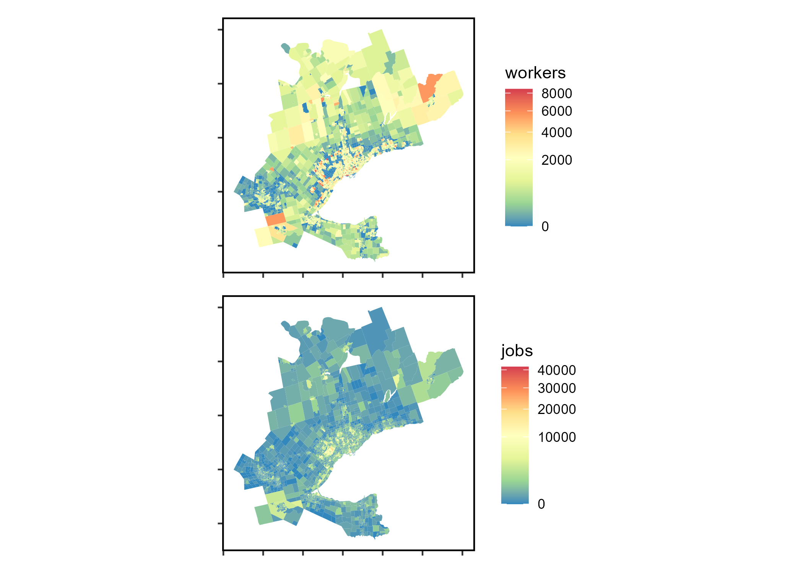

---
output:
 github_document:
 pandoc_args: --webtex
---

<!-- README.md is generated from README.Rmd. Please edit that file -->

```{r setup, include=FALSE}
knitr::opts_chunk$set(fig.pos = "!H", out.extra = "")
```

# Commuting to work data package: measuring potential access to work using the Transportation Tomorrow Survey (TTS) in the Greater Golden Horsehoe area, Canada

This repository contains working files for a data package to accompany the newly proposed  _singly-constrained competitive_ accessibility measure referred to as **spatial availability**. This measure is within the family of transport planning accessibility measures. This data-package is used in the  **Spatial Availability Measure** manuscript [here](https://github.com/soukhova/Spatial-Availability-Measure) (currently a work in progress).

All files are still a collaborative work in process. Contributors: Anastasia Soukhov, Antonio Paez, Chris Higgins, and Moataz Mohamed.


<!-- badges: start -->
<!-- badges: end -->


This data-package, includes toy data, empirical data, the proposed **spatial availability** function (`sp_avail`), and developed vignettes demonstrating an analysis and comparison of conventional gravity-based accessibility and **spatial availability**. 


#### What empirical data is included? 

The 2016 Transportation Tomorrow Survey (TTS) data for the the Greater Golden Horseshoe (GGH) area in the province of Ontario, Canada (43.6°N 79.73°W) is included; specifically the location of origins and destinations defined by Traffic Analysis Zones (TAZ), the number of jobs and workers at each origin and destination, and the trips from origin to destination for the morning home-to-work commute. Also included are calculated travel times by car (calculated via [`r5r`](https://github.com/ipeaGIT/r5r)) and a derived impedance function values corresponding to the cost of travel based on the trip length distribution.

```{r, echo=FALSE, fig.cap="The TTS study area within the sGreater Golden Horseshoe in Ontario, Canada.", out.height=400}
knitr::include_graphics("man/figures/Greater-Golden-Horseshoe-Map.png")
```

## Setup

Installation:

``` {r, eval = FALSE}
if (!require("remotes", character.only = TRUE)) {
      install.packages("remotes")
  }
remotes::install_github("soukhova/AccessPack",
                        build_vignettes = TRUE)
```

Libraries:

```{r, warning=FALSE, message=FALSE}
library(AccessPack)
library(tidyverse)
library(ggplot2)
library(kableExtra)
library(patchwork)
```

## Toy Data Overview

This data is hypothetical and created to explain the **spatial availability** measure in the first vignette. See the location and number of opportunities of employment centers and population centers in the plot below:

```{r toy-plot, include = FALSE}
ggplot(data = AccessPack::toy_sim_zones) + 
  geom_sf(aes(color = type,
              shape = type,
              size = number)) +
  geom_sf_text(aes(label = id_short),
               size = 3,
               nudge_y = -600) +
  scale_size(range = c(2, 7))  + 
  theme(legend.position = "bottom", axis.text = element_blank(),
        panel.grid = element_blank(),
        panel.background = element_rect(size = 1, 
                                        color = "black", 
                                        fill = NA))
ggsave("man/figures/toy-plot.png")
```

```{r, echo=FALSE, out.height=400}
knitr::include_graphics("man/figures/toy-plot.png")
```

Below is a sample of the OD table (Employment Center 1) for the theoretical toy data:

```{r, echo=FALSE} 
kable(toy_od_table %>% filter(Destination == "Employment Center 1"), "html")
```
## TTS 2016 Data Overview

The accessibility and **spatial availability** of this TTS 2016 data is analysed in the second vignette. See the plot below for the spatial visualization of the number of workers and jobs within each TAZ: 

```{r tts-workers-jobs-plot, include = FALSE, out.height=650}
tts_workers <- ggplot() +
  geom_sf(data = ggh_taz, 
          aes(fill= workers), color = NA) +
    scale_fill_distiller(palette = "Spectral", trans="sqrt")+ 
  theme(legend.position = "right", axis.text = element_blank(),
        panel.grid = element_blank(),
        panel.background = element_rect(size = 1, 
                                        color = "black", 
                                        fill = NA))

tts_jobs <- ggplot() +
  geom_sf(data = ggh_taz, 
          aes(fill= jobs), color = NA) +
    scale_fill_distiller(palette = "Spectral", trans="sqrt")+ 
  theme(legend.position = "right", axis.text = element_blank(),
        panel.grid = element_blank(),
        panel.background = element_rect(size = 1, 
                                        color = "black", 
                                        fill = NA))

tts_workers / tts_jobs

ggsave("man/figures/tts-workers-jobs-plot.png")
```

```{r, echo=FALSE}

```

Sample of TTS 2016 OD data (OD pairs with 2 trips):

```{r, echo=FALSE}
options(scipen = 999, digits = 3)
junk <- od_ft_tt %>% filter(trips == 2)
kable(junk, "html")
```

Summary statistics of TTS 2016 OD data, where `trips` are the number of journeys from origin to destination, calculated `travel_time` by car, and `f` is the impedance value:

```{r, echo=FALSE} 
options(scipen = 999, digits = 3)
kable(od_ft_tt %>% summary(), "html")
```
See .Rmd in the [`\data-raw folder`](https://github.com/soukhova/AccessPack/tree/master/data-raw) for additional details on how the datasets were compiled. See the [vignettes](https://soukhova.github.io/AccessPack/index.html) for detailed examples using the datasets and comparing comparison of the conventional accessibility and **spatial availability** (function `sp_avail`) measures.

