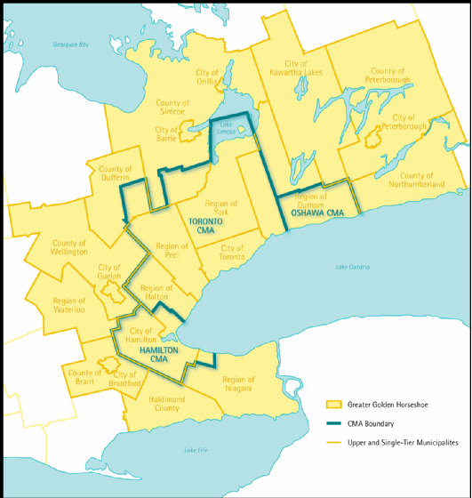

<!-- README.md is generated from README.Rmd. Please edit that file -->

# A Data Package to Accompany “Spatial Availability Measure”

This repository contains working files for a data-package to accompany
the newly proposed *proportionally allocated* accessibility measure
referred to as **spatial availability**. This measure is within the
family of transport planning accessibility measures. This data-package
is used in the **Spatial Availability Measure** manuscript
[here](https://github.com/soukhova/Spatial-Availability-Measure)
(current a work in progress).

All files are still a collaborative work in process. Contributors:
Anastasia Soukhov, Antonio Paez, Chris Higgins, and Moataz Mohamed.

<!-- badges: start -->
<!-- badges: end -->

This data-package, includes 2016 Transportation Tomorrow Survey (TTS)
data for the the Greater Golden Horseshoe Area.



This includes the location of origins and destinations defined by
Traffic Analysis Zones, the number of jobs and workers at each origin
and destination, travel times by car (calculated via
[`r5r`](https://github.com/ipeaGIT/r5r)), the proposed **spatial
availability** accessibility function (`SPavailability`), the
conventional accessibility function, and developed vignettes
demonstrating a toy example and the TTS data example.

# Installation

``` r
if(!require(remotes)){
    install.packages("remotes")
    library(remotes)
}
remotes::install_github("soukhova/AccessPack",
                         build_vignettes = TRUE)
```
