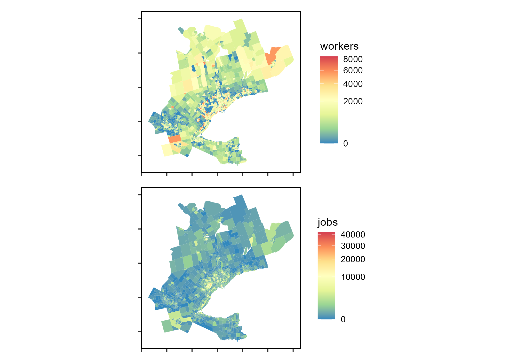

<!-- README.md is generated from README.Rmd. Please edit that file -->

# A Data Package to Accompany “Spatial Availability Measure”

This repository contains working files for a data-package to accompany
the newly proposed *proportionally allocated* accessibility measure
referred to as **spatial availability**. This measure is within the
family of transport planning accessibility measures. This data-package
is used in the **Spatial Availability Measure** manuscript
[here](https://github.com/soukhova/Spatial-Availability-Measure)
(currently a work in progress).

All files are still a collaborative work in process. Contributors:
Anastasia Soukhov, Antonio Paez, Chris Higgins, and Moataz Mohamed.

<!-- badges: start -->
<!-- badges: end -->

This data-package, includes toy data, empirical data, the proposed
**spatial availability** function (`sp_avail`), and developed vignettes
demonstrating an analysis and comparison of conventional accessibility
and **spatial availability**.

#### What empirical data is included?

The 2016 Transportation Tomorrow Survey (TTS) data for the the Greater
Golden Horseshoe (GGH) area in the province of Ontario, Canada (43.6°N
79.73°W) is included; specifically the location of origins and
destinations defined by Traffic Analysis Zones (TAZ), the number of jobs
and workers at each origin and destination, and the trips from origin to
destination for the morning home-to-work commute. Also included are
calculated travel times by car (calculated via
[`r5r`](https://github.com/ipeaGIT/r5r)) and a derived impedance
function values corresponding to the cost of travel based on the trip
length distribution.


## Setup

Installation:

``` r
if (!require("remotes", character.only = TRUE)) {
      install.packages("remotes")
  }
remotes::install_github("soukhova/AccessPack",
                        build_vignettes = TRUE)
```

Libraries:

``` r
library(AccessPack)
library(tidyverse)
library(ggplot2)
library(kableExtra)
library(patchwork)
```

## Toy Data Overview

This data is hypothetical and created to explain the **spatial
availability** measure in the first vignette. See the location and
number of opportunities of employment centers and population centers in
the plot below:


Below is a sample of the OD table (Employment Center 1) for the
theoretical toy data:

<table>
<thead>
<tr>
<th style="text-align:left;">
Origin
</th>
<th style="text-align:left;">
Destination
</th>
<th style="text-align:right;">
Population
</th>
<th style="text-align:right;">
Jobs
</th>
<th style="text-align:right;">
distance
</th>
<th style="text-align:right;">
catchments
</th>
<th style="text-align:right;">
trips
</th>
</tr>
</thead>
<tbody>
<tr>
<td style="text-align:left;">
Population 1
</td>
<td style="text-align:left;">
Employment Center 1
</td>
<td style="text-align:right;">
260
</td>
<td style="text-align:right;">
750
</td>
<td style="text-align:right;">
2548.060
</td>
<td style="text-align:right;">
1
</td>
<td style="text-align:right;">
88
</td>
</tr>
<tr>
<td style="text-align:left;">
Population 2
</td>
<td style="text-align:left;">
Employment Center 1
</td>
<td style="text-align:right;">
255
</td>
<td style="text-align:right;">
750
</td>
<td style="text-align:right;">
1314.074
</td>
<td style="text-align:right;">
1
</td>
<td style="text-align:right;">
591
</td>
</tr>
<tr>
<td style="text-align:left;">
Population 3
</td>
<td style="text-align:left;">
Employment Center 1
</td>
<td style="text-align:right;">
510
</td>
<td style="text-align:right;">
750
</td>
<td style="text-align:right;">
3374.923
</td>
<td style="text-align:right;">
0
</td>
<td style="text-align:right;">
24
</td>
</tr>
<tr>
<td style="text-align:left;">
Population 4
</td>
<td style="text-align:left;">
Employment Center 1
</td>
<td style="text-align:right;">
495
</td>
<td style="text-align:right;">
750
</td>
<td style="text-align:right;">
2170.200
</td>
<td style="text-align:right;">
0
</td>
<td style="text-align:right;">
157
</td>
</tr>
<tr>
<td style="text-align:left;">
Population 5
</td>
<td style="text-align:left;">
Employment Center 1
</td>
<td style="text-align:right;">
1020
</td>
<td style="text-align:right;">
750
</td>
<td style="text-align:right;">
5111.631
</td>
<td style="text-align:right;">
0
</td>
<td style="text-align:right;">
2
</td>
</tr>
<tr>
<td style="text-align:left;">
Population 6
</td>
<td style="text-align:left;">
Employment Center 1
</td>
<td style="text-align:right;">
490
</td>
<td style="text-align:right;">
750
</td>
<td style="text-align:right;">
6881.320
</td>
<td style="text-align:right;">
0
</td>
<td style="text-align:right;">
1
</td>
</tr>
<tr>
<td style="text-align:left;">
Population 7
</td>
<td style="text-align:left;">
Employment Center 1
</td>
<td style="text-align:right;">
980
</td>
<td style="text-align:right;">
750
</td>
<td style="text-align:right;">
4846.602
</td>
<td style="text-align:right;">
0
</td>
<td style="text-align:right;">
3
</td>
</tr>
<tr>
<td style="text-align:left;">
Population 8
</td>
<td style="text-align:left;">
Employment Center 1
</td>
<td style="text-align:right;">
260
</td>
<td style="text-align:right;">
750
</td>
<td style="text-align:right;">
5302.901
</td>
<td style="text-align:right;">
0
</td>
<td style="text-align:right;">
1
</td>
</tr>
<tr>
<td style="text-align:left;">
Population 9
</td>
<td style="text-align:left;">
Employment Center 1
</td>
<td style="text-align:right;">
255
</td>
<td style="text-align:right;">
750
</td>
<td style="text-align:right;">
7770.661
</td>
<td style="text-align:right;">
0
</td>
<td style="text-align:right;">
0
</td>
</tr>
</tbody>
</table>

## TTS 2016 Data Overview

The accessibility and **spatial availability** of this TTS 2016 data is
analysed in the second vignette. See the plot below for the spatial
visualization of the number of workers and jobs within each TAZ:



Sample of TTS 2016 OD data (OD pairs with 2 trips):

<table>
<thead>
<tr>
<th style="text-align:left;">
Origin
</th>
<th style="text-align:left;">
Destination
</th>
<th style="text-align:right;">
trips
</th>
<th style="text-align:right;">
travel_time
</th>
</tr>
</thead>
<tbody>
<tr>
<td style="text-align:left;">
3640
</td>
<td style="text-align:left;">
3718
</td>
<td style="text-align:right;">
2
</td>
<td style="text-align:right;">
24
</td>
</tr>
<tr>
<td style="text-align:left;">
3640
</td>
<td style="text-align:left;">
3849
</td>
<td style="text-align:right;">
2
</td>
<td style="text-align:right;">
20
</td>
</tr>
<tr>
<td style="text-align:left;">
3640
</td>
<td style="text-align:left;">
3866
</td>
<td style="text-align:right;">
2
</td>
<td style="text-align:right;">
20
</td>
</tr>
<tr>
<td style="text-align:left;">
3879
</td>
<td style="text-align:left;">
3877
</td>
<td style="text-align:right;">
2
</td>
<td style="text-align:right;">
8
</td>
</tr>
<tr>
<td style="text-align:left;">
3879
</td>
<td style="text-align:left;">
4003
</td>
<td style="text-align:right;">
2
</td>
<td style="text-align:right;">
17
</td>
</tr>
<tr>
<td style="text-align:left;">
3879
</td>
<td style="text-align:left;">
4007
</td>
<td style="text-align:right;">
2
</td>
<td style="text-align:right;">
18
</td>
</tr>
<tr>
<td style="text-align:left;">
3879
</td>
<td style="text-align:left;">
63
</td>
<td style="text-align:right;">
2
</td>
<td style="text-align:right;">
24
</td>
</tr>
<tr>
<td style="text-align:left;">
8417
</td>
<td style="text-align:left;">
3152
</td>
<td style="text-align:right;">
2
</td>
<td style="text-align:right;">
43
</td>
</tr>
<tr>
<td style="text-align:left;">
8417
</td>
<td style="text-align:left;">
3707
</td>
<td style="text-align:right;">
2
</td>
<td style="text-align:right;">
62
</td>
</tr>
<tr>
<td style="text-align:left;">
8417
</td>
<td style="text-align:left;">
3816
</td>
<td style="text-align:right;">
2
</td>
<td style="text-align:right;">
65
</td>
</tr>
<tr>
<td style="text-align:left;">
8417
</td>
<td style="text-align:left;">
55
</td>
<td style="text-align:right;">
2
</td>
<td style="text-align:right;">
82
</td>
</tr>
<tr>
<td style="text-align:left;">
8417
</td>
<td style="text-align:left;">
8415
</td>
<td style="text-align:right;">
2
</td>
<td style="text-align:right;">
43
</td>
</tr>
</tbody>
</table>

Summary statistics of TTS 2016 OD data, where `trips` are the number of
journeys from origin to destination, calculated `travel_time` by car,
and `f` is the impedance value:

<table>
<thead>
<tr>
<th style="text-align:left;">
</th>
<th style="text-align:left;">
Origin
</th>
<th style="text-align:left;">
Destination
</th>
<th style="text-align:left;">
trips
</th>
<th style="text-align:left;">
travel_time
</th>
</tr>
</thead>
<tbody>
<tr>
<td style="text-align:left;">
</td>
<td style="text-align:left;">
Length:103076
</td>
<td style="text-align:left;">
Length:103076
</td>
<td style="text-align:left;">
Min. : 1
</td>
<td style="text-align:left;">
Min. : 0
</td>
</tr>
<tr>
<td style="text-align:left;">
</td>
<td style="text-align:left;">
Class :character
</td>
<td style="text-align:left;">
Class :character
</td>
<td style="text-align:left;">
1st Qu.: 14
</td>
<td style="text-align:left;">
1st Qu.: 13
</td>
</tr>
<tr>
<td style="text-align:left;">
</td>
<td style="text-align:left;">
Mode :character
</td>
<td style="text-align:left;">
Mode :character
</td>
<td style="text-align:left;">
Median : 22
</td>
<td style="text-align:left;">
Median : 20
</td>
</tr>
<tr>
<td style="text-align:left;">
</td>
<td style="text-align:left;">
NA
</td>
<td style="text-align:left;">
NA
</td>
<td style="text-align:left;">
Mean : 33
</td>
<td style="text-align:left;">
Mean : 23
</td>
</tr>
<tr>
<td style="text-align:left;">
</td>
<td style="text-align:left;">
NA
</td>
<td style="text-align:left;">
NA
</td>
<td style="text-align:left;">
3rd Qu.: 38
</td>
<td style="text-align:left;">
3rd Qu.: 30
</td>
</tr>
<tr>
<td style="text-align:left;">
</td>
<td style="text-align:left;">
NA
</td>
<td style="text-align:left;">
NA
</td>
<td style="text-align:left;">
Max. :1129
</td>
<td style="text-align:left;">
Max. :179
</td>
</tr>
<tr>
<td style="text-align:left;">
</td>
<td style="text-align:left;">
NA
</td>
<td style="text-align:left;">
NA
</td>
<td style="text-align:left;">
NA
</td>
<td style="text-align:left;">
NA’s :3507
</td>
</tr>
</tbody>
</table>

See .Rmd in the
[`\data-raw folder`](https://github.com/soukhova/AccessPack/tree/master/data-raw)
for additional details on how the datasets were compiled. See the
[vignettes](https://soukhova.github.io/AccessPack/index.html) for
detailed examples using the datasets and comparing comparison of the
conventional accessibility and **spatial availability** (function
`sp_avail`) measures.
