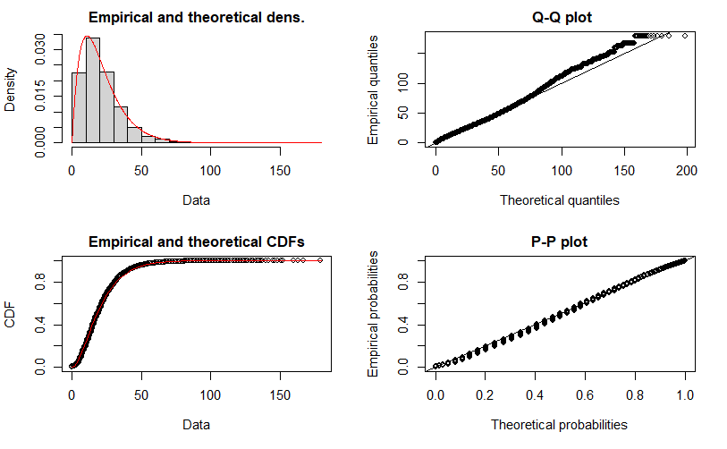
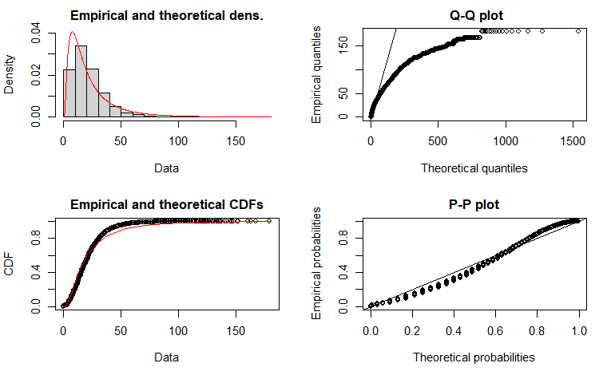

```{r, include = FALSE}
knitr::opts_chunk$set(
  collapse = TRUE,
  comment = "#>",
  fig.width = 7
)

options(scipen = 999)
```

In this vignette we calculate both the accessibility and the proposed *spatial availability* accessibility measures using the 2016 Transportation Tomorrow Survey (TTS) data for the Golden Horseshoe Area (GGH) in Ontario, Canada. We then explore these measures within the City of Toronto and compare the two calculated accessibility measures. 

All data used is contained with the `AccessPack` data-package and the *spatial availability* function (`sp_avail`) is described in detail in the previous vignette.

## Empircal Example Set-up

Load packages needed for the example:
```{r message = FALSE, warning = FALSE}
library(AccessPack)
library(dplyr)
library(ggplot2)
library(kableExtra)
library(patchwork)
library(sf)
# library(MASS)
# library(logspline)
```

The 'ggh_taz' is a spatial object which contains the number of workers, jobs, and area (km^2) for each traffic analysis zone (TAZ), see the workers per area:
```{r c1, warning = FALSE, message = FALSE, fig.height=6}
plot_ggh <- ggplot() +
  geom_sf(data = ggh_taz, 
          aes(fill= workers/AREA), color = NA) +
    scale_fill_distiller(palette = "Spectral", trans="sqrt") +
    guides(size = "none") + 
  theme(legend.position = "right",
        panel.grid = element_blank(),
        panel.background = element_rect(size = 1, 
                                        color = "black", 
                                        fill = NA))
plot_ggh
```

The `od_ft_tt` contains the trips made by workers to jobs (an Origin-Destination matrix). Each row contains the `origin` ID for a TAZ, the `destination` ID for a TAZ, the `trips` which are the journeys from origin to destination, `travel_time` is the travel time by car, as calculated using [`r5r`](https://github.com/ipeaGIT/r5r) for a departure of 7:00am (EST5EDT) on October 20th 2021 (a date selected at random), `f` is the impedance value. See ['data-raw' folder](https://github.com/soukhova/AccessPack/tree/master/data-raw) for data preparation .Rmd files.
```{r c2, warning = FALSE, message = FALSE}
junk <- od_ft_tt %>% select(trips, travel_time) %>% rename(Trips = trips,
                                                           Travel_Time = travel_time)
kable(junk %>% summary(), "html")
```

## Fitting Impedance Function

First, we create the Trip length distribution (TLD) by cutting the travel_time into 150 intervals and summing all trips within each interval. The TLD can be converted into a probability density function for likelihood of travel (as informed by travel time) by normalizing the the number of trips until a proportion of trips taken. This form of the TLD (black dots) and a theoretical gamma distribution (red line) which can be adjusted to fit the model are plotted below :

```{r c3, warning=FALSE, message=FALSE}
tld <- od_ft_tt %>%
  mutate(tt_classes = cut(travel_time, 
                          150,
                          ordered_result = TRUE)) %>%
  group_by(tt_classes) %>%
  summarize(trips = sum(trips),
            travel_time = mean(travel_time))

# Generate a random variates which follow a gamma distribution
x <- rgamma(1000, shape = 2, rate = 0.1)

# Covert to probability density function (PDF)
den <- density(x)
dat <- data.frame(x = den$x, y = den$y)

# Plot density as points
ggplot() + 
  geom_point(data = dat, aes(x = x, y = y), size = 3, colour="red") +
  geom_point(data = tld, aes(x = travel_time, y = trips/sum(trips))) +
  ylim(0, 0.08) +
  theme_classic()
```

Let's see if gamma is the most approrpiate distribution; to do this first a vector with every instance of travel_time for all ~3.0 mill trips is created:

```{r c4}
# remove all NA trips from dataset and set all 0min travel times to 0.1min
od_ft_tt  <- od_ft_tt %>% filter( !is.na(travel_time)) %>% mutate(travel_time = ifelse(travel_time == 0, 0.1, travel_time))
all_tt <- od_ft_tt  %>% dplyr::select(trips, travel_time)

all_tt <- all_tt[rep(seq_len(dim(all_tt)[1]), all_tt$trips), 2]
```


Next this vector of travel_times are plotted in a Cullen and Frey graph:

```{r c5, warning=FALSE, message=FALSE, fig.height=6}
fitdistrplus::descdist(data=all_tt) 
```
We can see that from this skewness-kurtosis graph that the observation is most similar to a lognormal distribution but also the gamma. Let's fit try fitting the vector to these two distributions using maximum likelihood estimation and compare:

```{r c6, warning=FALSE, message=FALSE, fig.width=7}
# using fitdist function to fit a distribution using the default maximum likelihood estimation method and Nelder-Mead method for direct optimization
gamma_ <- fitdistrplus::fitdist(data=all_tt, "gamma", method="mle", optim.method="Nelder-Mead") 
lnorm_ <- fitdistrplus::fitdist(data=all_tt, "lnorm", method="mle", optim.method="Nelder-Mead")
norm_ <-fitdistrplus::fitdist(data=all_tt, "norm", method="mle", optim.method="Nelder-Mead")
exp_ <- fitdistrplus::fitdist(data=all_tt, "exp", method="mle", optim.method="Nelder-Mead")
```


```{r c8a, echo=FALSE, out.height="80%", out.width="90%", fig.align='center'}
# plot(gamma_)

```

```{r c8b, echo=FALSE, out.height="80%", out.width="90%", fig.align='center'}
# plot(lnorm_)

```


The gamma distribution fit looks more accurate; especially at predicting the longer travel times. Correspondingly, goodness of fit criteria such as the Akaike information criterion (AIC) and Bayesian information criterion (BIC) for the gamma distribution (along with lognormal and exponential and normal distribution for reference) are calculated. The AIC and BIC measure the trade-off between the goodness of fit of the model and the simplicity of the model when comparing against candidate models; a model which looks like a good fit but has a high AIC and BIC value indicates issues of overfitting thus the lower the value the better the candidate model:

```{r c9, warning=FALSE, message=FALSE} 
Distribution <-  c("Gamma", "Exp", "Lognormal", "Normal")
AIC <- c(gamma_$aic, exp_$aic, lnorm_$aic, norm_$aic)
BIC <- c(gamma_$bic, exp_$bic, lnorm_$bic, norm_$bic)
df <- data.frame(Distribution, AIC, BIC)
kable(df, "html")
```

Let's plot the TLD with the gamma theoretical distribution:

```{r c10, warning=FALSE, message=FALSE}
ggplot(data = tld, aes(x = travel_time, y = trips/sum(trips))) + 
  geom_point(size = 3) +     
  geom_line(aes(x=travel_time, y=dgamma(travel_time, gamma_$estimate["shape"], gamma_$estimate["rate"])), 
            color="red", size = 1) + 
  theme_classic()

```

The fit looks good with exception to some outliers near the peak. Let's retain the parameters for this gamma function and use it as our impedance function for the TTS 2016 dataset:

```{r c11}
kable(gamma_ %>% coef(), "html")
```

Gamma function:
$$ 
f(x, \alpha, \beta) = \frac {x^{\alpha-1}e^{-x / \beta }} { \beta ^{\alpha}\Gamma(\alpha)} \quad \text{for }	0 \leq x \leq \infty
$$
where the estimated 'shape' is $\alpha$,the estimated 'rate' is $\beta$, and the $\Gamma(\alpha) $ is defined as:

$$
\Gamma(\alpha) =  \int_{0}^{\infty} x^{\alpha-1}e^{-x} \,dx \
$$   

Let's now add the values of $f(x, \alpha, \beta)$ to the OD table as a column named 'f'. As a point of summary, 'f' captures our theoretical cost of travel (i.e. probability of travel based on the trip-length-distribution (a PDF) of empirical trips and associated travel time).

```{r c12}
#dgamma is the density plot for gamma function
od_ft_tt <- od_ft_tt %>%
  mutate(f = dgamma(travel_time, gamma_$estimate["shape"], gamma_$estimate["rate"]))
```


## Accessibility Analysis

Using the TTS-16 dataset describe in the first vignette; let's calculate accessibility using the empirical dataset. The impedance function is already defined. 

Calculate accessibility:
```{r c13, warning=FALSE, message=FALSE}
#add the number of jobs and workers to the od_ft_tt matrix
od_ft <- od_ft_tt %>% merge(ggh_taz %>% dplyr::select(GTA06, workers) %>% st_drop_geometry(),
                   by.x = "Origin", by.y="GTA06", all.x = TRUE)

od_ft <- od_ft %>% merge(ggh_taz %>% dplyr::select(GTA06, jobs) %>% st_drop_geometry(),
                   by.x = "Destination", by.y="GTA06", all.x = TRUE)

# calculate accessibility 
c_accessibility <- od_ft %>% 
  mutate(A_ij = f * jobs) %>%
  group_by(Origin) %>%
  summarise(A_i = sum(A_ij, na.rm = T),
            trips_i = sum(trips, na.rm = T))
```

Merge accessibly calculation to the ggh_taz:
```{r c14, warning = FALSE, message = FALSE}
ggh_taz_acc <- ggh_taz %>% merge(c_accessibility, by.x=c("GTA06"), by.y=c("Origin"), all.x=T) 
```

Plot accessibility (accessible jobs in each TAZ):
```{r c15, warning = FALSE, message = FALSE, fig.height=6}
plot_c_access <- ggplot() +
  geom_sf(data = ggh_taz_acc, 
          aes(fill= A_i), color = NA) +
  scale_fill_distiller(palette = "Spectral", trans="sqrt")+
    guides(size = "none") + 
  theme(legend.position = "right",
        panel.grid = element_blank(),
        panel.background = element_rect(size = 1, 
                                        color = "black", 
                                        fill = NA))

plot_c_access
```
**NOTE:** Grey TAZs contain no trips from origins thus have no calculated `A_i`; 22% of TAZs are greyed out. 

## Spatial Availability

The impedance function is already defined, let's calculate **spatial availability** as described in the first vignette using the TTS-16 dataset :
```{r c16, warning = FALSE, message = FALSE}
od_ft <- od_ft %>%
  mutate(catch = 1) %>%
  mutate(V_ij = sp_avail(., 
                         o_id = Origin,
                         d_id = Destination,
                         pop = workers,
                         opp = jobs,
                         r = catch,
                         f = f))
```

Verify that the sum of all jobs allocated is consistent with the total number of jobs. This property of proportional allocation is one of this measure's novel contribution:
```{r c17, warning = FALSE, message = FALSE}
sum(od_ft$V_ij, na.rm=T)

sum_jobs <- od_ft %>% group_by(Destination) %>% summarise(jobs = mean(jobs))
sum(sum_jobs$jobs, na.rm = T)
```
The total number of jobs is preserved.

Aggregate available jobs ('V_ij') by origin:
```{r c18, warning = FALSE, message = FALSE}
availability <- od_ft %>%
  group_by(Origin) %>%
  summarize(V_i = sum(V_ij)) 
```
Now merge accessibly calculation to the ggh_taz:
```{r, warning = FALSE, message = FALSE}
ggh_taz_acc <- ggh_taz_acc %>% merge(availability, by.x=c("GTA06"), by.y=c("Origin"), all.x=T) 
```

Plot *spatial availability* (accessible *available* jobs in each TAZ): 
```{r c19, warning = FALSE, message = FALSE, fig.height=6}
plot_avail <- ggplot() +
  geom_sf(data = ggh_taz_acc, 
          aes(fill= V_i), color = NA) +
  scale_fill_distiller(palette = "Spectral", trans="sqrt")+
    guides(size = "none") + 
  theme(legend.position = "right",
        panel.grid = element_blank(),
        panel.background = element_rect(size = 1, 
                                        color = "black", 
                                        fill = NA))

plot_avail
```


## Comparing Accessibility and Spatial Availability


Plot origin accessibility vs. availability (with the City of Toronto Boundary):
```{r c20, warning = FALSE, message = FALSE, fig.height=12}
plot_avail <- ggplot() +
  geom_sf(data = ggh_taz_acc, 
          aes(fill= V_i), color = NA) +
    scale_fill_distiller(palette = "Spectral", trans="sqrt") + 
  geom_sf(data = AccessPack::toronto_muni_bound, colour="black", fill=NA) +
    guides(size = "none") + 
  theme(legend.position = "right",
        panel.grid = element_blank(),
        panel.background = element_rect(size = 1, 
                                        color = "black", 
                                        fill = NA))

plot_c_access <- ggplot() +
  geom_sf(data = ggh_taz_acc, 
          aes(fill= A_i), color = NA) +
    scale_fill_distiller(palette = "Spectral", trans="sqrt") + 
  geom_sf(data = AccessPack::toronto_muni_bound, colour="black", fill=NA)+
    guides(size = "none") + 
  theme(legend.position = "right",
        panel.grid = element_blank(),
        panel.background = element_rect(size = 1, 
                                        color = "black", 
                                        fill = NA))


plot_avail / plot_c_access
```

- at the ggh resolution, we see here how the accessibility relatively over-inflates the number of jobs available in the more densely populated (and higher number of jobs) within the Toronto area 

Let's take a closer look at the measures just within the City of Toronto boundary.

### City of Toronto Comparision
As many trips are made to Toronto from outside of Toronto; the analysis must be repeated within this new boundary. 

Preparing Toronto spatial data:
```{r c21, warning = FALSE, message = FALSE}
#transform CRS
toronto_muni_bound <- st_transform(AccessPack::toronto_muni_bound, crs=32617)

#select only zones within Toronto Municipality
TO_taz <- ggh_taz_acc %>%
  filter(st_intersects(., toronto_muni_bound, sparse = FALSE)[,1]) %>% dplyr::select(GTA06, AREA, jobs)
```

#### Calculate accessibility for Toronto:

Only calculating for origins anywhere in the ggh to destinations in Toronto:
```{r c22}
#jobs at destinations IN Toronto and origins from anywhere; workers are associated with the origin (ggh) and jobs with the destination (Toronto)
TO_od_ft <- od_ft %>% dplyr::select(-V_ij) %>% filter(Destination %in% TO_taz$GTA06)

#calculate accessibility for workers from any origin to jobs in Toronto 
TO_c_accessibility <- TO_od_ft %>% 
  mutate(TO_A_ij = f * jobs) %>%
  group_by(Origin) %>%
  summarise(TO_A_i = sum(TO_A_ij, na.rm = T),
            trips_i = sum(trips, na.rm = T))

#Merge TO accessibly calculation to the ggh_taz:
TO_taz_acc <- ggh_taz %>% merge(TO_c_accessibility, by.x=c("GTA06"), by.y=c("Origin"), all.y=T) 
```

#### Now calculated **spatial availability** for Toronto: 

Again, only clculating for origins anywhere in the ggh to destinations in Toronto:
```{r c23, warning = FALSE, message = FALSE}
#calculate spatial availability
TO_od_ft <- TO_od_ft %>%
  mutate(TO_V_ij = sp_avail(., 
                         o_id = Origin,
                         d_id = Destination,
                         pop = workers,
                         opp = jobs,
                         r = catch,
                         f = f))
```

Verify that the sum of all jobs allocated is consistent with the total number of jobs. This property of proportional allocation is one of this measure's novel contribution:
```{r c24, warning = FALSE, message = FALSE}
sum(TO_od_ft$TO_V_ij, na.rm=T)

sum_jobs <- TO_od_ft %>% group_by(Destination) %>% summarise(jobs = mean(jobs))
sum(sum_jobs$jobs, na.rm = T)
```
The total number of jobs is preserved.

Aggregate available jobs ('TO_V_ij') by origin and merge:
```{r c25, warning = FALSE, message = FALSE}
TO_availability <- TO_od_ft %>%
  group_by(Origin) %>%
  summarize(TO_V_i = sum(TO_V_ij)) 

#Merge TO availability calculation to the TAZ sf object created for accessibility above:
TO_taz_acc <- TO_taz_acc %>% merge(TO_availability, by.x=c("GTA06"), by.y=c("Origin"), all.x=T) 
```


Plot origin accessibility vs. availability for Toronto
```{r c26, warning = FALSE, message = FALSE, fig.align='center', fig.height=12}
plot_avail <- ggplot() +
  geom_sf(data = TO_taz_acc,
          aes(fill= TO_V_i), color = NA) +
    scale_fill_distiller(palette = "Spectral",  trans = "sqrt")+
    guides(size = "none") + 
  theme(legend.position = "right",
        panel.grid = element_blank(),
        panel.background = element_rect(size = 1, 
                                        color = "black", 
                                        fill = NA))
plot_c_access <- ggplot() +
  geom_sf(data = TO_taz_acc, 
          aes(fill= TO_A_i), color = NA) +
    scale_fill_distiller(palette = "Spectral", trans = "sqrt")+
    guides(size = "none") + 
  theme(legend.position = "right",
        panel.grid = element_blank(),
        panel.background = element_rect(size = 1, 
                                        color = "black", 
                                        fill = NA))

plot_avail / plot_c_access
```


